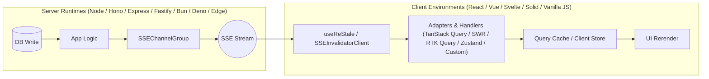

# ⚡️ restale-kit

[](https://www.npmjs.com/package/restale-kit)
[](https://github.com/gerkim62/restale-kit/blob/main/LICENSE)
[](https://nodejs.org/api/esm.html)
[](https://www.typescriptlang.org/)
[](https://github.com/gerkim62/restale-kit/blob/main/README.md#-contributing--community)

> **Real-time cache-invalidation signals from your server to TanStack Query, SWR, RTK Query, or any client store (Zustand, Vue, Svelte, Vanilla JS) over Server-Sent Events.**
>
> Push cache invalidations instantly when backend data changes — zero polling, zero WebSocket overhead, zero manual cache management. Works seamlessly with any query cache or state management system.

---

## 🧭 How It Works



---

## ✨ Features

- **🚀 Universal & Framework Agnostic:** Zero runtime dependencies in core. Runs in Node.js, Bun, Deno, Cloudflare Workers, Next.js, and all modern browsers.
- **🔄 Flexible Client Support:** Built-in adapters for **TanStack Query** and **SWR**, native wire protocol support for **RTK Query**, plus generic invalidation listeners for **Zustand**, **Pinia / Vue**, **Svelte**, **SolidJS**, **Redux**, or **Vanilla JS**. Not locked into any single cache library!
- **🔌 Multi-Runtime Server Adapters:** Drop-in support for Express, Fastify, Hono, Node `http`, Bun, Deno, and standard Fetch API runtimes.
- **🎯 Precision Invalidation:** Flexible key matching supports prefix keys, exact matches, hierarchical paths, and object-subset targeting.
- **🛡️ Standard Schema Validation:** Validate invalidation payloads on server & client using Zod, Valibot, ArkType, or any Standard Schema validator.
- **🌐 Horizontally Scalable:** Pub/Sub adapters for Redis, Ably, and Pusher enable multi-instance and serverless cluster invalidations.
- **⚡️ Resilience Built-In:** Automatic client reconnects with exponential backoff, jitter, and history replay via `Last-Event-ID`.

---

## 🔌 Ecosystem & Client Compatibility

`restale-kit` is designed to invalidate **any** client cache or state container. Below is an overview of current adapter support and integration options:

| Client & State Library | Support Level | Integration Method |
|---|---|---|
| **TanStack Query** (React / Solid / Vue) | ⚡️ First-class Adapter | `tanstackQueryAdapter`, `useTanstackQueryAdapter` |
| **SWR** (React) | ⚡️ First-class Adapter | `swrAdapter`, `useSwrAdapter` |
| **RTK Query** (Redux Toolkit) | 🔌 Wire Protocol | `target: 'rtk-query'` with tag-based invalidations |
| **Zustand / Redux / Pinia** | 🎯 Generic Listener | `target: 'generic'` with custom `onInvalidate` callback |
| **Vue / Nuxt** | 🟢 Framework Agnostic | `SSEInvalidatorClient` / custom handler |
| **Svelte / SvelteKit** | 🟠 Framework Agnostic | `SSEInvalidatorClient` / custom handler |
| **Vanilla JS / DOM** | 🌐 Native `EventTarget` | `SSEInvalidatorClient` (`addEventListener('invalidate', ...)`) |

---

## 🚀 Quick Start

### 1. Install

```sh
pnpm add restale-kit
# or
npm install restale-kit
```

### 2. Server (Express / Hono / Node / Bun / Deno)

```ts
import express from 'express'
import { SSEChannelGroup } from 'restale-kit/server'

const app = express()
const group = new SSEChannelGroup({
  channelDefaults: { target: ['swr', 'tanstack-query'] },
})

app.get('/sse', (req, res) => {
  group.attachChannel(req, res, { meta: { userId: req.user.id } })
})

app.post('/api/todos', async (req, res) => {
  // ... database mutation ...
  group.broadcastToAll({ key: ['todos'] })
  res.status(201).json({ success: true })
})

app.listen(3000)
```

### 3. Client Options

#### Option A: React + TanStack Query
```tsx
import { useQuery, useQueryClient } from '@tanstack/react-query'
import { useReStale } from 'restale-kit/react'
import { useTanstackQueryAdapter } from 'restale-kit/tanstack-query'

function TodoList() {
  const queryClient = useQueryClient()
  const onInvalidate = useTanstackQueryAdapter(queryClient)

  useReStale('/sse', { onInvalidate })

  const { data: todos } = useQuery({
    queryKey: ['todos'],
    queryFn: () => fetch('/api/todos').then(r => r.json()),
  })

  return (
    <ul>
      {todos?.map((t: any) => <li key={t.id}>{t.title}</li>)}
    </ul>
  )
}
```

#### Option B: Vanilla JS / Custom Store (Zustand, Vue, Svelte, etc.)
```ts
import { SSEInvalidatorClient } from 'restale-kit/client'

const client = new SSEInvalidatorClient('/sse', { autoReconnect: true })

// Listen for invalidation signals and dispatch to any store or refetch handler
client.addEventListener('invalidate', (event) => {
  const signal = event.detail // InvalidateSignal | InvalidateSignal[]
  console.log('Received cache invalidation:', signal)
  
  // Example: Invalidate Zustand store, Vue refetch, or custom fetch logic
  myAppStore.markStale(signal.key)
})

await client.connect()
```

---

## 📂 Repository & Workspace Layout

This repository is a monorepo powered by `pnpm` containing the core library, documentation, design specifications, and runnable example apps:

- **[restale-kit/](./restale-kit/)** — The published NPM library source code (server & client adapters, pub/sub drivers, standard schema support).
- **[docs/](./docs/)** — Detailed user documentation and integration guides.
  - 📖 [Getting Started](./docs/getting-started.md)
  - 🖥️ [Server Adapters](./docs/server.md)
  - 💻 [Client Adapters](./docs/client.md)
  - 🛡️ [Payload Validation](./docs/validation.md)
  - 🌐 [Distributed Pub/Sub](./docs/pubsub.md)
  - 📚 [API Reference](./docs/api-reference.md)
- **[examples/](./examples/)** — Ready-to-run backend and frontend examples.
  - Backend: [Express](./examples/backend/express/), [Hono](./examples/backend/hono/), [Fastify](./examples/backend/fastify/), [Node http](./examples/backend/node/)
  - Frontend: [React + TanStack Query](./examples/frontend/react-query/), [React + SWR](./examples/frontend/react-swr/)
  - Full-stack: [Vercel Serverless + Redis](./examples/vercel-redis/)
- **[spec/](./spec/)** — Architectural decision records, frame guard specifications, and wire protocol definitions.

---

## 🤝 Contributing & Community

We warmly welcome contributions from everyone! Whether you are fixing a typo, improving documentation, writing tests, building a new adapter, or creating an example app — your contributions make **restale-kit** better for the entire developer community.

### 🌟 Ways You Can Contribute

- **🔌 New Client Adapters & Framework Integration:** Build dedicated hooks or adapters for **Vue / Pinia**, **Svelte**, **SolidJS**, **RTK Query**, **Zustand**, or **Angular**.
- **🔌 New Server & Pub/Sub Adapters:** Help build adapters for NATS, RabbitMQ, Kafka, GCP PubSub, NestJS, Fastify plugins, or Deno runtimes.
- **📖 Documentation & Fullstack Examples:** Improve existing docs or build example projects for popular web frameworks (Next.js App Router, Nuxt 3, Remix, SvelteKit, Astro).
- **🐛 Bug Reports & Code Quality:** Report bugs with reproduction steps or submit PRs to enhance test coverage and performance.

### 🛠️ Local Development Setup

1. **Clone the Repository:**
   ```sh
   git clone https://github.com/gerkim62/restale-kit.git
   cd restale-kit
   ```

2. **Install Dependencies:**
   ```sh
   pnpm install
   ```

3. **Build the Core Library:**
   ```sh
   pnpm run build
   ```

4. **Run Validation & Typecheck:**
   ```sh
   pnpm run validate
   ```

5. **Run the Test Suite:**
   ```sh
   # Unit tests & consumer package verification
   pnpm run test:package

   # Full CI test run (with coverage)
   pnpm run test:ci
   ```

6. **Interactive Example Playground:**
   Run the interactive script to select and launch backend and frontend example servers concurrently:
   ```sh
   pnpm example
   ```

   Or run specific services individually:
   | Command | Description |
   |---|---|
   | `pnpm dev:express` | Runs the Express backend example |
   | `pnpm dev:hono` | Runs the Hono backend example |
   | `pnpm dev:fastify` | Runs the Fastify backend example |
   | `pnpm dev:node` | Runs the native Node HTTP backend example |
   | `pnpm dev:client` | Runs the React + TanStack Query frontend example |
   | `pnpm dev:swr` | Runs the React + SWR frontend example |

### 📋 Pull Request Guidelines

1. **Create a Feature Branch:** `git checkout -b feature/my-amazing-feature` or `fix/my-bug-fix`
2. **Keep Changes Focused:** Small, self-contained PRs are easier to review.
3. **Verify Quality:** Before submitting, make sure `pnpm run validate` and `pnpm run test:package` pass cleanly.
4. **Update Docs:** If introducing a new API or behavior change, please update the corresponding guide in `docs/`.

---

## 📄 License

Distributed under the MIT License. See [LICENSE](./restale-kit/README.md) for details.
