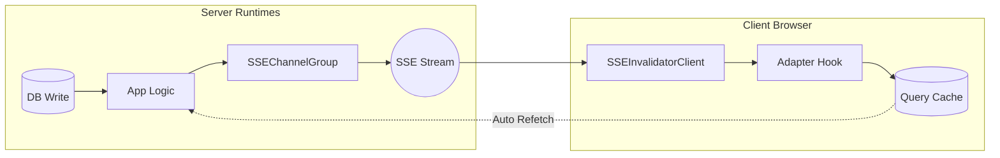

# ⚡️ restale-kit

[](https://www.npmjs.com/package/restale-kit)
[](https://github.com/gerkim62/restale-kit/blob/main/LICENSE)
[](https://nodejs.org/api/esm.html)

Push real-time cache-invalidation signals from your server to TanStack Query, SWR, or custom client stores over Server-Sent Events.

---

## What It Does

`restale-kit` sends lightweight invalidation signals over Server-Sent Events whenever backend data changes. Connected client applications receive signals and automatically mark matching query cache keys stale, triggering background refetches without polling or websockets. It carries zero data payloads, preserving your existing HTTP REST and GraphQL authorization pipelines.


```mermaid
flowchart LR
    subgraph Server ["Server Runtimes"]
        db[(DB Write)] --> app[App Logic]
        app --> group[SSEChannelGroup]
        group --> stream((SSE Stream))
    end

    subgraph Client ["Client Browser"]
        stream --> client[SSEInvalidatorClient]
        client --> adapter[Adapter Hook]
        adapter --> cache[(Query Cache)]
        cache -. Auto Refetch .-> app
    end
```

---

## Install

```sh
npm install restale-kit
```

---

## Quick Start

### Server (`server.ts`)

```ts
import express from 'express'
import { SSEChannelGroup, SIGNAL_TARGETS } from 'restale-kit/server'

const app = express()
const group = new SSEChannelGroup({ channelDefaults: { target: SIGNAL_TARGETS.TANSTACK_QUERY } })

app.get('/api/sse', (req, res) => group.attachNodeResponse(req, res))
app.post('/api/todos', (req, res) => {
  group.broadcastToAll({ queryKey: ['todos'] })
  res.status(201).json({ success: true })
})
app.listen(3000)
```

### Client (`App.tsx`)

```tsx
import React from 'react'
import { useQueryClient } from '@tanstack/react-query'
import { useReStale } from 'restale-kit/react'
import { useTanstackQueryAdapter } from 'restale-kit/tanstack-query'

export function App() {
  const qc = useQueryClient()
  const onInvalidate = useTanstackQueryAdapter(qc)
  useReStale('/api/sse', { onInvalidate })

  return <div>Todo List Application</div>
}
```

---

## Documentation

| Guide | Summary |
|---|---|
| [Getting Started](./docs/getting-started.md) | Fastest path to a working Express + TanStack Query integration in under 10 minutes |
| [Concepts](./docs/concepts.md) | SSE lifecycle mental model, key architectural decisions, and terminology glossary |
| [Server Guide](./docs/server.md) | `SSEChannelGroup` setup, framework adapters, broadcasting methods, and connection revocation |
| [Client Guide](./docs/client.md) | `useReStale` React hook, `SSEInvalidatorClient`, framework adapters, and connection status |
| [Signals & Keys](./docs/signals.md) | `InvalidateSignal` discriminated union shapes, key matching semantics, and `SIGNAL_TARGETS` |
| [Pub/Sub & Scaling](./docs/pubsub.md) | Horizontal scaling across multiple server instances with Redis, Ably, Pusher, and payload encryption |
| [Validation & Safety](./docs/validation.md) | Built-in structural wire validation and custom metadata validation using `metaSchema` |
| [Security Guide](./docs/security.md) | Recommended HTTP-only cookie authentication, `connectionId` correlation caveats, and CORS configuration |
| [API Reference](./docs/api-reference.md) | Exhaustive TypeScript signatures for all 12 package subpaths |
| [Integration Examples](./docs/examples.md) | Annotated, copy-paste runnable server and client integration examples |
| [Troubleshooting](./docs/troubleshooting.md) | Common error codes, causes, and step-by-step resolution paths |
| [Changelog](./docs/changelog.md) | Complete version history and release notes |
| [Discrepancies Audit](./docs/DISCREPANCIES.md) | Audit record of discrepancies between past documentation and source implementation |

---

## License

[MIT](./LICENSE)
