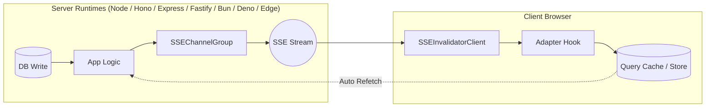

# Concepts & Mental Model

## 1. How It Works

`restale-kit` establishes a persistent, lightweight Server-Sent Events (SSE) stream between your server and connected client browsers. Whenever data changes on the server, your backend emits a minimal **cache-invalidation signal** over the SSE stream. The client receives the signal and instructs its local state manager (such as TanStack Query or SWR) to mark the corresponding query keys as stale, triggering an automatic background refetch.

### The SSE Lifecycle

1. **Connect**: The client initiates an HTTP GET request to the SSE endpoint. The server responds with `Content-Type: text/event-stream` and keeps the response stream open.
2. **Receive Signal**: When a backend mutation completes, the server writes a JSON frame (e.g. `event: invalidate`) down the open stream.
3. **Invalidate Cache**: The client-side adapter parses the signal and invokes native query cache methods (such as `queryClient.invalidateQueries` or `mutate`).
4. **Refetch**: Active UI components holding observers for the invalidated query keys execute their standard fetch logic to retrieve fresh data.

---

## 2. Key Decisions

### Why SSE Over WebSockets?
Server-Sent Events run over standard HTTP/1.1 and HTTP/2 connections, automatically leveraging existing HTTP infrastructure such as load balancers, HTTP-only cookies, firewall rules, and compression. SSE is unidirectional (server to client), eliminating the protocol overhead and complex state management required for full-duplex WebSockets when the client only needs to receive push updates.

### Why Cache Invalidation Signals Instead of Data Payloads?
Transmitting entire entity payloads over a push channel introduces race conditions, partial cache updates, payload size bloat, and authorization bypass risks (pushing data to a client before evaluating authorization rules). Invalidation signals carry only the keys or tags identifying *what* changed (e.g. `{ queryKey: ['todos'] }`). The client then refetches through standard HTTP endpoints, ensuring all authentication, authorization, validation, and middleware run normally.

### Why No Polling?
Interval polling wastes server CPU cycles, database queries, and mobile battery life fetching data that has not changed. SSE connections remain idle with zero overhead until an actual write event occurs.

### What `restale-kit` Does NOT Do
- **Does NOT store application data**: `restale-kit` only transports lightweight invalidation messages.
- **Does NOT replace your HTTP REST/GraphQL API**: Data fetching continues to happen through standard HTTP endpoints.
- **Does NOT manage database subscriptions**: You call `group.broadcastToAll(...)` or `group.publish(...)` explicitly inside your backend mutation handlers or database hooks.

---

## 3. Glossary

Alphabetical glossary of terms used across `restale-kit`:

- **adapter (client)**: A wrapper function (e.g., `useTanstackQueryAdapter`, `useSwrAdapter`) that translates incoming `InvalidateSignal` payloads into query cache operations.
- **adapter (server)**: A helper method (`attachNodeResponse`, `createFetchResponse`) that formats HTTP response headers and binds an incoming request stream to an `SSEChannel`.
- **broadcast**: The server method (`group.broadcast`) that sends an invalidation signal to all locally connected channels matching a predicate function.
- **broadcastToAll**: The server method (`group.broadcastToAll`) that sends an invalidation signal to all locally connected channels in a group.
- **connectionId**: A unique UUID generated by the client (`__restale_cid__`) used to correlate and manage individual stream connections.
- **InvalidateSignal**: A discriminated union object specifying the target framework and query keys or tags to mark stale.
- **meta**: Arbitrary server-side key-value context (e.g. `userId`, `tenantId`) associated with an `SSEChannel` at registration time for targeted broadcasting.
- **publish**: The server method (`group.publish`) that sends a signal or control message to a named pub/sub topic across multiple server instances.
- **revocation**: The process of closing an active SSE connection from the server (`revokeByConnectionId`, `revokeWhere`) and notifying the client to suppress auto-reconnection.
- **SIGNAL_TARGETS**: An object constant listing supported framework target strings (`TANSTACK_QUERY`, `SWR`, `RTK`, `GENERIC`).
- **SignalTarget**: The string discriminator identifier (`'tanstack-query'`, `'swr'`, `'rtk-query'`, `'generic'`) matching a target framework.
- **SSEChannel**: A single server-side representation of an active client stream.
- **SSEChannelGroup**: A manager class that groups multiple `SSEChannel` instances for local broadcasting, topic management, and pub/sub routing.
- **topic**: A named pub/sub channel string used to route invalidation signals across horizontally scaled server nodes.
