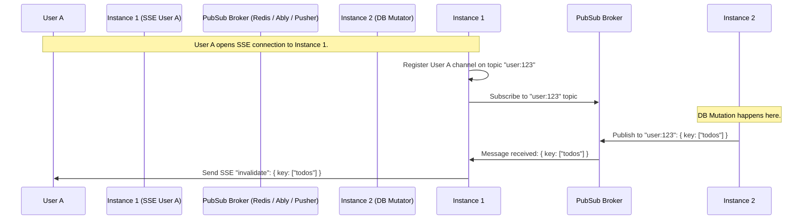

# ⚡️ restale-kit

[](https://www.npmjs.com/package/restale-kit)
[](https://github.com/gerkim62/restale-kit/blob/main/LICENSE)
[](https://nodejs.org/api/esm.html)

`restale-kit` is a lightweight, high-performance, and framework-agnostic library designed to invalidate client-side caches (such as **TanStack Query** and **SWR**) over **Server-Sent Events (SSE)**. 

One job, done exceptionally well.

---

## 🧭 The Mental Model

In modern web applications, client-side caching libraries keep the UI responsive by caching query results. However, when database mutations occur, keeping those caches in sync with the server usually requires polling, short caching times, or complex state management.

`restale-kit` bridges this gap. It provides a lightweight, real-time SSE stream to push **invalidation signals** (hierarchical keys like `['todos', { userId: 4 }]`) from the server directly to the client. Upon receiving a signal, `restale-kit`'s client-side adapters automatically mark queries as stale, trigger immediate refetches, or purge them from the cache.

```mermaid
flowchart LR
    subgraph Server ["Server Side (Node / Fetch-API / Hono / Express / Fastify)"]
        db[(Database / Mutator)] -->|DB Write / Event| app[Your App Logic]
        app -->|channel.invalidate signal| group[SSEChannelGroup]
        group -->|SSE Event: 'invalidate'| wire((SSE Stream))
    end
    
    subgraph Client ["Client Side (React / Vanilla JS)"]
        wire -->|wire connection| client[SSEInvalidatorClient / useReStale]
        client -->|onInvalidate| adapter[tanstackAdapter / swrAdapter]
        adapter -->|Invalidate / Refetch / Remove| cache[Client Cache (TanStack Query / SWR)]
        cache -->|Reactive Update| ui[UI Rerender]
    end
```

---

## ✨ Features

- **🔋 Framework & Cache Agnostic:** Core protocol and client libraries have zero runtime dependencies and run in any JS environment.
- **⚡ First-Class Server Adapters:** Built-in support for Hono, Express, Fastify, native Node.js `http` module, and standard Fetch-API `Request`/`Response` runtimes (e.g. Bun, Deno, Cloudflare Workers, Vercel Edge).
- **🔌 First-Class Client Adapters:** Native adapters for **TanStack Query** and **SWR**, with a React hook (`useReStale`) for zero-boilerplate setup.
- **🎯 Precision Invalidation:** Signal keys match hierarchically (with support for prefix matching, exact matching, and nested object property matching) to invalidate exactly what changed.
- **🛡️ Standard Schema Type Safety (Optional):** Define validation schemas with **Zod**, **Valibot**, **ArkType**, etc. to validate invalidation signals and connection metadata at compilation and runtime.
- **🌐 Horizontally Scalable (Pub/Sub):** Built-in adapters for **Redis**, **Ably**, and **Pusher** to coordinate invalidation signals across multi-instance server deployments and serverless environments.
- **🩹 Robust Client Resilience:** Automated exponential backoff and randomized jitter to handle connection drops gracefully.

---

## 📦 Installation

Install the core package:

```sh
npm install restale-kit
```

Install the peer dependencies depending on your server-side framework, client-side caching library, or distributed pub/sub provider:

```sh
# Client-side peers
npm install @tanstack/react-query react swr

# Server-side scaling peers
npm install ioredis ably pusher
```

> [!NOTE]
> All peer dependencies are optional; you only need to install the packages your application actually uses.

---

## 🗺️ Export Imports Map

`restale-kit` exports specialized subpath entrypoints to keep bundles small and ensure you only import what is required.

| Import Subpath | Target Role | Key Symbols |
|---|---|---|
| `restale-kit` | Core types and exceptions | `JSONValue`, `InvalidateSignal`, `ChannelClosedError`, `SchemaValidationError` |
| `restale-kit/server` | Connection and group management | `createSSEChannel`, `SSEChannelGroup` |
| `restale-kit/node` | Node.js native server helper | `attachSSE` |
| `restale-kit/express` | Express.js framework helper | `attachSSE` |
| `restale-kit/fastify` | Fastify framework helper (requires `reply.hijack()`) | `attachSSE` |
| `restale-kit/fetch` | Fetch-API Response helper (Bun, Cloudflare, Edge) | `toSSEResponse` |
| `restale-kit/hono` | Hono framework helper | `toSSEResponse` |
| `restale-kit/client` | Vanilla JS / Non-React core client | `SSEInvalidatorClient` |
| `restale-kit/react` | React framework hook | `useReStale` |
| `restale-kit/tanstack-query` | TanStack Query cache adapter | `tanstackAdapter` |
| `restale-kit/swr` | SWR cache adapter | `swrAdapter` |
| `restale-kit/pubsub` | distributed Pub/Sub contract | `PubSubAdapter` |
| `restale-kit/redis` | Distributed Redis adapter | `redisPubSubAdapter` |
| `restale-kit/ably` | Distributed Ably adapter | `ablyPubSubAdapter` |
| `restale-kit/pusher` | Distributed Pusher adapter | `pusherPubSubAdapter` |

---

## 🚀 Quick Start (Express + TanStack Query)

### 1. Server Setup (Express)

Create an SSE endpoint, register connected clients in an `SSEChannelGroup`, and broadcast invalidations when a mutation occurs.

```ts
import express from 'express'
import { SSEChannelGroup } from 'restale-kit/server'
import { attachSSE } from 'restale-kit/express'

const app = express()
app.use(express.json())

const group = new SSEChannelGroup()

// 1. Establish SSE Connection
app.get('/sse', (req, res) => {
  const channel = attachSSE(req, res)
  group.register(channel, {})
  
  req.on('close', () => {
    group.deregister(channel)
  })
})

// 2. Broadcast on mutations
app.post('/api/todos', async (req, res) => {
  // ... perform write mutation in your database ...
  
  // Invalidate 'todos' queries for all connected clients
  group.broadcastToAll({ key: ['todos'] })
  
  res.status(201).json({ success: true })
})

app.listen(3000, () => console.log('Server running on port 3000'))
```

### 2. Client Setup (React + TanStack Query)

Wire `useReStale` to your query client. Your queries will automatically refetch when the server broadcasts invalidations.

```tsx
import { useQueryClient, useQuery } from '@tanstack/react-query'
import { useReStale } from 'restale-kit/react'
import { tanstackAdapter } from 'restale-kit/tanstack-query'

function App() {
  const queryClient = useQueryClient()

  // Connects to SSE and automatically maps incoming invalidation signals to your Cache
  const { connection } = useReStale('/sse', {
    onInvalidate: tanstackAdapter(queryClient),
  })

  const { data: todos } = useQuery({
    queryKey: ['todos'],
    queryFn: () => fetch('/api/todos').then(res => res.json())
  })

  return (
    <div>
      <header>Status: {connection.status}</header>
      <ul>{todos?.map(todo => <li key={todo.id}>{todo.title}</li>)}</ul>
    </div>
  )
}
```

---

## 🛠️ Other Server Frameworks

### Hono (Cloudflare Workers, Bun, Deno, Edge, etc.)
Fetch-based runtimes return a `Response` containing a `ReadableStream`. Use `toSSEResponse` to create the stream and respond.

```ts
import { Hono } from 'hono'
import { SSEChannelGroup } from 'restale-kit/server'
import { toSSEResponse } from 'restale-kit/hono'

const app = new Hono()
const group = new SSEChannelGroup()

app.get('/sse', (c) => {
  const { response, channel } = toSSEResponse(c.req.raw)
  group.register(channel, {})

  c.req.raw.signal.addEventListener('abort', () => {
    group.deregister(channel)
  })

  return response
})
```

### Fastify
Because Fastify manages HTTP response streams, you must call `reply.hijack()` before passing raw sockets.

```ts
import Fastify from 'fastify'
import { SSEChannelGroup } from 'restale-kit/server'
import { attachSSE } from 'restale-kit/fastify'

const app = Fastify()
const group = new SSEChannelGroup()

app.get('/sse', (request, reply) => {
  reply.hijack() // Required: prevents Fastify from writing responses on top of SSE
  const channel = attachSSE(request.raw, reply.raw)
  group.register(channel, {})

  request.raw.on('close', () => {
    group.deregister(channel)
  })
})
```

### Native Node.js `http` Server
```ts
import http from 'http'
import { SSEChannelGroup } from 'restale-kit/server'
import { attachSSE } from 'restale-kit/node'

const group = new SSEChannelGroup()

const server = http.createServer((req, res) => {
  if (req.url === '/sse') {
    const channel = attachSSE(req, res)
    group.register(channel, {})
    req.on('close', () => group.deregister(channel))
  }
})
```

---

## 🎯 Invalidation Signals & Key Matching

An invalidation signal is structured as follows:

```ts
interface InvalidateSignal {
  key: JSONValue[]          // Hierarchical key components
  exact?: boolean           // If true, requires exact match. Default: false
  action?: 'invalidate' | 'refetch' | 'remove' // Cache action. Default: 'invalidate'
}
```

### How Actions Map to Client Caches

| Signal Action | Meaning | TanStack Query | SWR |
|---|---|---|---|
| `'invalidate'` (default) | Mark matching queries as stale. Refetch if active. | `queryClient.invalidateQueries(filters)` | `mutate(filter)` (triggers revalidation) |
| `'refetch'` | Force immediate network reload of matching queries. | `queryClient.refetchQueries(filters)` | `mutate(filter)` (triggers revalidation) |
| `'remove'` | Completely purge matching entries from client memory. | `queryClient.removeQueries(filters)` | `mutate(filter, undefined, false)` (no revalidate) |

### Key Matching Semantics

Key matching uses **hierarchical subset matching** by default (`exact: false`). A signal's key matches if it is a prefix of the client-side cache key, and any objects in the signal key are **subsets** of objects in the cache key.

#### Examples:
Suppose a query has cache key `['todos', { userId: 4, type: 'active' }, 'list']`.

- **Prefix matching (`exact: false`):**
  - `{ key: ['todos'] }` ➡️ **Matches** (matches prefix).
  - `{ key: ['todos', { userId: 4 }] }` ➡️ **Matches** (partial object subset match).
  - `{ key: ['todos', { userId: 4, type: 'active' }] }` ➡️ **Matches** (exact object match).
  - `{ key: ['todos', { userId: 4, label: 'work' }] }` ➡️ **Fails** (unmatched object property).
  - `{ key: [] }` ➡️ **Matches everything** (useful for global cache invalidation on deployment).

- **Exact matching (`exact: true`):**
  - `{ key: ['todos', { userId: 4, type: 'active' }, 'list'], exact: true }` ➡️ **Matches**.
  - `{ key: ['todos'], exact: true }` ➡️ **Fails** (length mismatch).

---

## 🛡️ Zod & Standard Schema Type Safety

`restale-kit` integrates natively with the [Standard Schema spec v1](https://github.com/standard-schema/standard-schema) (supported by Zod, Valibot, ArkType, etc.). Passing validation schemas enforces compilation-level type checking and runtime schema validation for both invalidation signals and connection metadata.

### Server-side Validation with Zod

```ts
import { z } from 'zod'
import { SSEChannelGroup } from 'restale-kit/server'
import { attachSSE } from 'restale-kit/express'

// 1. Define schema for valid signal payloads
const AppSignalSchema = z.object({
  key: z.union([
    z.tuple([z.literal('todos')]),
    z.tuple([z.literal('todos'), z.object({ userId: z.string() })]),
    z.tuple([z.literal('users'), z.string()]),
  ]),
  exact: z.boolean().optional(),
  action: z.enum(['invalidate', 'refetch', 'remove']).optional(),
})
type AppSignal = z.infer<typeof AppSignalSchema>

// 2. Define schema for connection metadata
const ClientMetaSchema = z.object({
  userId: z.string(),
  role: z.enum(['user', 'admin']),
})
type ClientMeta = z.infer<typeof ClientMetaSchema>

// 3. Create typed channel group
const group = new SSEChannelGroup<AppSignal, ClientMeta>({
  metaSchema: ClientMetaSchema,
})

app.get('/sse', (req, res) => {
  // 4. Attach validation to client connection
  const channel = attachSSE(req, res, { signalSchema: AppSignalSchema })
  
  // Validation runs synchronously. Invalid meta will throw SchemaValidationError
  group.register(channel, { userId: req.user.id, role: req.user.role })
  
  req.on('close', () => group.deregister(channel))
})

// 5. Types are validated at compile-time:
group.broadcast(
  { key: ['todos', { userId: '123' }] }, // ✅ Valid AppSignal structure
  (meta) => meta.role === 'admin'
)

// group.broadcast({ key: ['posts'] }, ...) // ❌ TypeScript Error (invalid key pattern)
```

### Client-side Validation with Zod

```tsx
import { z } from 'zod'
import { useReStale } from 'restale-kit/react'
import { tanstackAdapter } from 'restale-kit/tanstack-query'

const AppSignalSchema = z.object({
  key: z.array(z.unknown()),
  exact: z.boolean().optional(),
  action: z.enum(['invalidate', 'refetch', 'remove']).optional(),
})
type AppSignal = z.infer<typeof AppSignalSchema>

function App() {
  const queryClient = useQueryClient()

  // Types incoming invalidations. Emits 'error' if validation fails
  const { connection } = useReStale<AppSignal>('/sse', {
    signalSchema: AppSignalSchema,
    onInvalidate: tanstackAdapter(queryClient),
  })
}
```

---

## 🌐 Distributed Pub/Sub (Scaling Horizontally)

When scaling to multiple instances or serverless backends, instances don't share memory. An SSE connection is tied to a single instance, but queries can be modified by mutations on another instance.

To solve this, configure `SSEChannelGroup` with a distributed **Pub/Sub Adapter**. In this model:
1. Client channels register interest in specific string topics (e.g. `user:123`, `admin-alerts`).
2. Your server calls `group.publish(topic, signal)`.
3. The adapter sends the signal across the broker (Redis, Ably, Pusher).
4. Every instance receives the signal and delivers it to any locally registered channels listening to that topic.



### 1. Redis Adapter (`ioredis`)

```ts
import Redis from 'ioredis'
import { SSEChannelGroup } from 'restale-kit/server'
import { redisPubSubAdapter } from 'restale-kit/redis'

const redisClient = new Redis()

const group = new SSEChannelGroup({
  pubsub: redisPubSubAdapter(redisClient),
})

app.get('/sse', (req, res) => {
  const channel = attachSSE(req, res)
  
  // Register channel to listen to topic "user:<userId>"
  group.register(channel, { userId: req.user.id }, {
    topics: [`user:${req.user.id}`]
  })
  
  req.on('close', () => group.deregister(channel))
})

// Trigger distributed invalidation (propagates to all instances)
async function onTodoMutation(userId: string) {
  await group.publish(`user:${userId}`, { key: ['todos'] })
}
```

### 2. Ably Adapter (`ably`)

```ts
import * as Ably from 'ably'
import { SSEChannelGroup } from 'restale-kit/server'
import { ablyPubSubAdapter } from 'restale-kit/ably'

const ably = new Ably.Realtime({ key: 'YOUR_API_KEY', echoMessages: false })

const group = new SSEChannelGroup({
  pubsub: ablyPubSubAdapter(ably, { useNativeEchoSuppression: true }),
})
```

### 3. Pusher Server Adapter (`pusher`)

Because Pusher uses HTTP webhooks rather than TCP channels to push events to servers, you must wire a webhook handler route.

```ts
import Pusher from 'pusher'
import { SSEChannelGroup } from 'restale-kit/server'
import { pusherPubSubAdapter } from 'restale-kit/pusher'

const pusher = new Pusher({ appId: '...', key: '...', secret: '...', cluster: '...' })
const pubsub = pusherPubSubAdapter(pusher)

const group = new SSEChannelGroup({ pubsub })

// Webhook endpoint to receive messages from Pusher
app.post('/pusher/webhook', (req, res) => {
  const body = req.rawBody // Ensure raw body string is captured
  const headers = req.headers as Record<string, string>
  
  const processed = pubsub.handleWebhook(body, headers)
  res.status(processed ? 200 : 400).end()
})
```

---

## 🔌 Vanilla JS / Non-React Clients

If you are not using React, you can import and control the SSE connection client directly.

```ts
import { SSEInvalidatorClient } from 'restale-kit/client'

const client = new SSEInvalidatorClient('/sse', {
  autoReconnect: true,
  // Set to true when connecting cross-origin with cookie-based authentication.
  withCredentials: true,
  reconnect: {
    baseDelayMs: 1000,
    maxDelayMs: 30000,
    jitter: true,
  }
})

// Listen to invalidation events
client.addEventListener('invalidate', (event) => {
  const signal = event.detail // InvalidateSignal | InvalidateSignal[]
  console.log('Received invalidation signals:', signal)
  
  // Custom manual cache invalidation code here...
})

// Track status changes
client.addEventListener('statuschange', (event) => {
  console.log('Status changed:', event.detail.status) // 'connecting' | 'open' | 'closed' | 'error'
})

// Initiate connection
await client.connect()

// Later, teardown connection
// client.close()
```

---

## ⚙️ API Configuration Reference

### Client Configurations

#### `SSEInvalidatorClient(url, options)`
- `url`: `string` SSE endpoint URL.
- `options`:
  - `autoReconnect`: `boolean` (Default: `true`). Reconnect on socket drop.
  - `reconnect`: Object
    - `baseDelayMs`: `number` (Default: `1000`). Start delay.
    - `maxDelayMs`: `number` (Default: `30000`). Delay cap.
    - `jitter`: `boolean` (Default: `true`). Add random jitter factor.
    - `maxRetries`: `number` (Default: `Infinity`).
  - `signalSchema`: `StandardSchema` (Optional). Validate signal before dispatching.
  - `withCredentials`: `boolean` (Default: `false`). Include credentials in the SSE request. For cross-origin SSE, the server must send `Access-Control-Allow-Credentials: true` and a specific `Access-Control-Allow-Origin` value (not `*`).

#### `useReStale(url, options)`
- Extends all `SSEInvalidatorClient` options and adds:
  - `disabled`: `boolean` (Default: `false`). Delay/prevent connection.
  - `onInvalidate`: `(signal: InvalidateSignal | InvalidateSignal[]) => void`. Callback executed on signal arrival.

### Server Configurations

#### `createSSEChannel(options)` / `attachSSE(req, res, options)` / `toSSEResponse(request, options)`
- `options`:
  - `keepaliveIntervalMs`: `number` (Default: `30000`). Interval of SSE keepalive comments to prevent connection drops.
  - `signalSchema`: `StandardSchema` (Optional). Enforces type and validates signal on `channel.invalidate()`.

#### `SSEChannelGroup(options)`
- `options`:
  - `metaSchema`: `StandardSchema` (Optional). Validates client connection metadata registered.
  - `pubsub`: `PubSubAdapter` (Optional). Horizontal scaling adapter.

---

## 📄 License

MIT © [Gerison Kimathi](https://github.com/gerkim62)
