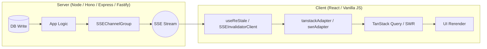

# ⚡️ restale-kit

[](https://www.npmjs.com/package/restale-kit)
[](https://github.com/gerkim62/restale-kit/blob/main/LICENSE)
[](https://nodejs.org/api/esm.html)

Push cache-invalidation signals from your server to every connected client over **Server-Sent Events**. TanStack Query and SWR automatically refetch when your data changes — no polling, no websockets, no manual cache busting.

One job, done exceptionally well.

---

## 🧭 Mental Model



---

## ✨ Features

- **Framework agnostic:** Zero runtime dependencies in core. Works in any JS environment.
- **First-class server adapters:** Express, Fastify, Hono, Node `http`, and any Fetch-API runtime (Bun, Deno, Cloudflare Workers, Vercel Edge).
- **First-class client adapters:** TanStack Query, SWR, and a React hook (`useReStale`) for zero-boilerplate wiring.
- **Precision invalidation:** Hierarchical key matching with prefix, exact, and object-subset semantics.
- **Optional Standard Schema validation:** Zod, Valibot, ArkType, etc. — type-safe signals and metadata at compile and runtime.
- **Horizontally scalable:** Built-in pub/sub adapters for Redis, Ably, and Pusher.
- **Robust reconnection:** Exponential backoff with jitter; configurable retries.

---

## 📦 Installation

```sh
npm install restale-kit
```

Install optional integration dependencies for your stack:

```sh
npm install @tanstack/react-query react   # TanStack Query
npm install swr                           # SWR
npm install ioredis                       # Redis pub/sub
npm install ably                          # Ably pub/sub
npm install pusher                        # Pusher pub/sub
```

---

## 🗺️ Import Map

| Subpath | Contents |
|---|---|
| `restale-kit` | `JSONValue`, `InvalidateSignal`, `ChannelClosedError`, `SchemaValidationError` |
| `restale-kit/server` | `createSSEChannel`, `SSEChannelGroup` |
| `restale-kit/node` | `attachSSE` (Node `http`) |
| `restale-kit/express` | `attachSSE` |
| `restale-kit/fastify` | `attachSSE` (requires `reply.hijack()`) |
| `restale-kit/fetch` | `toSSEResponse` (Bun, Deno, Cloudflare Workers) |
| `restale-kit/hono` | `toSSEResponse` |
| `restale-kit/client` | `SSEInvalidatorClient` |
| `restale-kit/react` | `useReStale` |
| `restale-kit/tanstack-query` | `tanstackAdapter` |
| `restale-kit/swr` | `swrAdapter` |
| `restale-kit/pubsub` | `PubSubAdapter` interface |
| `restale-kit/redis` | `redisPubSubAdapter` |
| `restale-kit/ably` | `ablyPubSubAdapter` |
| `restale-kit/pusher` | `pusherPubSubAdapter` |

---

## 🚀 Quick Start

### Server (Express)

```ts
import express from 'express'
import { SSEChannelGroup } from 'restale-kit/server'
import { attachSSE } from 'restale-kit/express'

const app = express()
app.use(express.json())

const group = new SSEChannelGroup()

app.get('/sse', (req, res) => {
  const channel = attachSSE(req, res)
  group.register(channel, {})
  req.on('close', () => group.deregister(channel))
})

app.post('/api/todos', async (req, res) => {
  // ... write to DB ...
  group.broadcastToAll({ key: ['todos'] })
  res.status(201).json({ success: true })
})

app.listen(3000)
```

### Client (React + TanStack Query)

```tsx
import { useQuery, useQueryClient } from '@tanstack/react-query'
import { useReStale } from 'restale-kit/react'
import { tanstackAdapter } from 'restale-kit/tanstack-query'

function App() {
  const queryClient = useQueryClient()

  useReStale('/sse', {
    onInvalidate: tanstackAdapter(queryClient),
  })

  const { data: todos } = useQuery({
    queryKey: ['todos'],
    queryFn: () => fetch('/api/todos').then(r => r.json()),
  })

  return <ul>{todos?.map(t => <li key={t.id}>{t.title}</li>)}</ul>
}
```

---

## 🛠️ Other Server Frameworks

### Hono / Bun / Deno / Edge

```ts
import { Hono } from 'hono'
import { SSEChannelGroup } from 'restale-kit/server'
import { toSSEResponse } from 'restale-kit/hono'

const app = new Hono()
const group = new SSEChannelGroup()

app.get('/sse', (c) => {
  const { response, channel } = toSSEResponse(c.req.raw)
  group.register(channel, {})
  c.req.raw.signal.addEventListener('abort', () => group.deregister(channel))
  return response
})
```

### Fastify

```ts
import { attachSSE } from 'restale-kit/fastify'

app.get('/sse', (request, reply) => {
  reply.hijack() // required — prevents Fastify writing its own response
  const channel = attachSSE(request.raw, reply.raw)
  group.register(channel, {})
  request.raw.on('close', () => group.deregister(channel))
})
```

### Native Node.js

```ts
import { attachSSE } from 'restale-kit/node'

const server = http.createServer((req, res) => {
  if (req.url === '/sse') {
    const channel = attachSSE(req, res)
    group.register(channel, {})
    req.on('close', () => group.deregister(channel))
  }
})
```

---

## 🎯 Invalidation Signals & Key Matching

```ts
interface InvalidateSignal {
  key: JSONValue[]                              // hierarchical key
  exact?: boolean                              // default false = prefix match
  action?: 'invalidate' | 'refetch' | 'remove' // default 'invalidate'
}
```

**Key matching (prefix mode, `exact: false`):**

Given cache key `['todos', { userId: 4, type: 'active' }]`:

| Signal key | Matches? |
|---|---|
| `['todos']` | ✅ prefix |
| `['todos', { userId: 4 }]` | ✅ object subset |
| `['todos', { userId: 4, type: 'active' }]` | ✅ exact match |
| `['todos', { userId: 4, label: 'work' }]` | ❌ unknown property |
| `[]` | ✅ matches everything |

**Actions:**

| `action` | TanStack Query | SWR |
|---|---|---|
| `'invalidate'` (default) | `invalidateQueries` | `mutate(filter)` |
| `'refetch'` | `refetchQueries` | `mutate(filter)` |
| `'remove'` | `removeQueries` | `mutate(filter, undefined, false)` |

---

## 🔌 Vanilla JS / Non-React Client

```ts
import { SSEInvalidatorClient } from 'restale-kit/client'

const client = new SSEInvalidatorClient('/sse', {
  autoReconnect: true,
  withCredentials: false, // set true for cross-origin with cookie auth
})

client.addEventListener('invalidate', (event) => {
  const signal = event.detail // InvalidateSignal | InvalidateSignal[]
})

client.addEventListener('statuschange', (event) => {
  console.log(event.detail.status) // 'connecting' | 'open' | 'closed' | 'error'
})

await client.connect()
```

---

## 🛡️ Standard Schema Validation (Optional)

Pass a Zod (or any Standard Schema-compatible) schema to enforce types at compile time and validate at runtime.

**Server:**
```ts
import { z } from 'zod'

const AppSignalSchema = z.object({
  key: z.union([
    z.tuple([z.literal('todos')]),
    z.tuple([z.literal('todos'), z.object({ userId: z.string() })]),
  ]),
  exact: z.boolean().optional(),
  action: z.enum(['invalidate', 'refetch', 'remove']).optional(),
})
type AppSignal = z.infer<typeof AppSignalSchema>

const group = new SSEChannelGroup<AppSignal>()

app.get('/sse', (req, res) => {
  const channel = attachSSE(req, res, { signalSchema: AppSignalSchema })
  group.register(channel, {})
  req.on('close', () => group.deregister(channel))
})

group.broadcastToAll({ key: ['todos'] })           // ✅ valid
// group.broadcastToAll({ key: ['posts'] })        // ❌ TypeScript error
```

**Client:**
```tsx
useReStale<AppSignal>('/sse', {
  signalSchema: AppSignalSchema,
  onInvalidate: tanstackAdapter(queryClient),
})
```

→ Full guide: [Validation](https://github.com/gerkim62/restale-kit/blob/main/docs/validation.md)

---

## 🌐 Distributed Pub/Sub

When scaling across multiple instances or serverless functions, use a pub/sub adapter to coordinate invalidations:

```ts
import Redis from 'ioredis'
import { redisPubSubAdapter } from 'restale-kit/redis'

const group = new SSEChannelGroup({
  pubsub: redisPubSubAdapter(new Redis(process.env.REDIS_URL)),
})

app.get('/sse', (req, res) => {
  const channel = attachSSE(req, res)
  group.register(channel, { userId: req.user.id }, {
    topics: [`user:${req.user.id}`],
  })
  req.on('close', () => group.deregister(channel))
})

// Any instance — reaches the correct client regardless of which instance holds the connection
await group.publish(`user:${userId}`, { key: ['todos'] })
```

Also available: `ablyPubSubAdapter` and `pusherPubSubAdapter`.

→ Full guide: [Pub/Sub](https://github.com/gerkim62/restale-kit/blob/main/docs/pubsub.md)

---

## ⚙️ API Quick Reference

### `useReStale(url, options)`

| Option | Type | Default | Description |
|---|---|---|---|
| `onInvalidate` | `(signal) => void` | — | **Required.** Called on each signal. |
| `autoReconnect` | `boolean` | `true` | Reconnect on drop. |
| `withCredentials` | `boolean` | `false` | Send cookies cross-origin. |
| `disabled` | `boolean` | `false` | Prevent connection. |
| `signalSchema` | `StandardSchema` | — | Runtime signal validation. |
| `reconnect.baseDelayMs` | `number` | `1000` | Initial retry delay. |
| `reconnect.maxDelayMs` | `number` | `30000` | Max retry delay. |
| `reconnect.jitter` | `boolean` | `true` | Randomise delay. |
| `reconnect.maxRetries` | `number` | `Infinity` | Give up after N retries. |

### `SSEChannelGroup(options?)`

| Option | Description |
|---|---|
| `metaSchema` | Validates connection metadata on `register()`. |
| `pubsub` | Pub/sub adapter for multi-instance scaling. |

### `attachSSE(req, res, options?)` / `toSSEResponse(request, options?)`

| Option | Default | Description |
|---|---|---|
| `keepaliveIntervalMs` | `30000` | SSE keepalive comment interval. |
| `signalSchema` | — | Validate signals before sending. |

→ Full API: [API Reference](https://github.com/gerkim62/restale-kit/blob/main/docs/api-reference.md)

---

## 📚 Documentation

- [Getting Started](https://github.com/gerkim62/restale-kit/blob/main/docs/getting-started.md)
- [Server Guide](https://github.com/gerkim62/restale-kit/blob/main/docs/server.md)
- [Client Guide](https://github.com/gerkim62/restale-kit/blob/main/docs/client.md)
- [Validation Guide](https://github.com/gerkim62/restale-kit/blob/main/docs/validation.md)
- [Pub/Sub Guide](https://github.com/gerkim62/restale-kit/blob/main/docs/pubsub.md)
- [API Reference](https://github.com/gerkim62/restale-kit/blob/main/docs/api-reference.md)

---

## 📄 License

MIT © [Gerison Kimathi](https://github.com/gerkim62)
