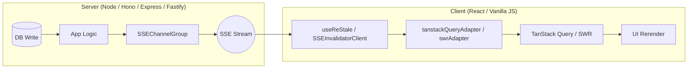

# ⚡️ restale-kit

[](https://www.npmjs.com/package/restale-kit)
[](https://github.com/gerkim62/restale-kit/blob/main/LICENSE)
[](https://nodejs.org/api/esm.html)

Push cache-invalidation signals from your server to every connected client over **Server-Sent Events**. TanStack Query and SWR automatically refetch when your data changes — no polling, no websockets, no manual cache busting.

One job, done exceptionally well.

---

## 🧭 Mental Model


```mermaid
flowchart LR
    subgraph Server ["Server (Node / Hono / Express / Fastify)"]
        db[(DB Write)] --> app[App Logic]
        app --> group[SSEChannelGroup]
        group --> wire((SSE Stream))
    end
    subgraph Client ["Client (React / Vanilla JS)"]
        wire --> client[useReStale / SSEInvalidatorClient]
        client --> adapter[tanstackQueryAdapter / swrAdapter]
        adapter --> cache[TanStack Query / SWR]
        cache --> ui[UI Rerender]
    end
```

---

## ✨ Features

- **Framework agnostic:** Zero runtime dependencies in core. Works in any JS environment.
- **First-class server adapters:** Express, Fastify, Hono, Node `http`, and any Fetch-API runtime (Bun, Deno, Cloudflare Workers, Vercel Edge).
- **First-class client adapters:** TanStack Query, SWR, and a React hook (`useReStale`) for zero-boilerplate wiring.
- **Precision invalidation:** Hierarchical key matching with prefix, exact, and object-subset semantics.
- **Optional Standard Schema metadata validation:** Use Zod, Valibot, ArkType, etc. to validate connection metadata at runtime; signals have compile-time types and built-in structural validation.
- **Horizontally scalable:** Built-in pub/sub adapters for Redis, Ably, and Pusher.
- **Robust reconnection:** Exponential backoff with jitter; configurable retries.

---

## 📋 Prerequisites

- **Node.js**: `>=18.0.0` (uses native Web Streams `ReadableStream`, Web Fetch API, `EventTarget`, and ES2024 features).

---

## 📦 Installation

```sh
npm install restale-kit
```

Install optional integration dependencies for your stack:

```sh
npm install @tanstack/react-query react   # TanStack Query
npm install swr                           # SWR
npm install ioredis                       # Redis pub/sub
npm install ably                          # Ably pub/sub
npm install pusher                        # Pusher pub/sub
```

---

## 🗺️ Import Map & Main Exports

| Subpath | Key Exports | Description |
|---|---|---|
| `restale-kit` | `JSONValue`, `InvalidateSignal`, `SIGNAL_TARGETS`, `ChannelClosedError` | Core types and protocol constants |
| `restale-kit/server` | `SSEChannelGroup`, `createSSEChannel`, `SIGNAL_TARGETS` | Server-side channels and channel group manager |
| `restale-kit/testing` | `createSSEChannel` | Standalone SSE channel creation helper |
| `restale-kit/client` | `SSEInvalidatorClient`, `makeAdaptedCallback` | Vanilla JS client |
| `restale-kit/react` | `useReStale` | React hook for SSE stream management |
| `restale-kit/tanstack-query` | `tanstackQueryAdapter`, `useTanstackQueryAdapter` | TanStack Query invalidation adapter |
| `restale-kit/swr` | `swrAdapter`, `useSwrAdapter` | SWR invalidation adapter |
| `restale-kit/rtk-query` | `rtkQueryAdapter`, `useRtkQueryAdapter` | RTK Query tag invalidation adapter |
| `restale-kit/pubsub` | `PubSubAdapter` interface | Base PubSub interface |
| `restale-kit/redis` | `redisPubSubAdapter` | Redis PubSub adapter |
| `restale-kit/ably` | `ablyPubSubAdapter` | Ably PubSub adapter |
| `restale-kit/pusher` | `pusherPubSubAdapter` | Pusher PubSub adapter |

> **Note on Naming**: `createSSEChannel` creates individual SSE streams, while `SSEChannelGroup` manages multi-client broadcasting and pub/sub routing. Use `SIGNAL_TARGETS.TANSTACK_QUERY`, `SIGNAL_TARGETS.SWR`, `SIGNAL_TARGETS.RTK`, or `SIGNAL_TARGETS.GENERIC` for target configuration.

---

## 🚀 Quick Start

### Server (Express)

```ts
import express from 'express'
import { SSEChannelGroup, SIGNAL_TARGETS } from 'restale-kit/server'

const app = express()
app.use(express.json())
app.use(authenticateUserAndSession) // Populate req.user & req.session

const group = new SSEChannelGroup({
  channelDefaults: { target: [SIGNAL_TARGETS.SWR, SIGNAL_TARGETS.TANSTACK_QUERY] },
})

app.get('/sse', (req, res) => {
  group.attachNodeResponse(req, res, {
    meta: {
      userId: req.user.id,
      sessionId: req.session.id,
    },
  })
})

app.post('/api/todos', async (req, res) => {
  // ... write todo to DB ...
  group.broadcastToAll([
    { target: SIGNAL_TARGETS.SWR, key: ['todos'] },
    { target: SIGNAL_TARGETS.TANSTACK_QUERY, queryKey: ['todos'] },
  ])
  res.status(201).json({ success: true })
})

// Revoke one connection with scope-pinning
app.post('/api/logout', async (req, res) => {
  await group.revokeByConnectionId(req.body.connectionId, {
    userId: req.user.id,
    sessionId: req.session.id,
  })
  res.json({ success: true })
})

app.listen(3000)
```

### Client (React + TanStack Query)

```tsx
import { useQuery, useQueryClient } from '@tanstack/react-query'
import { useReStale } from 'restale-kit/react'
import { useTanstackQueryAdapter } from 'restale-kit/tanstack-query'

function TodoList() {
  const queryClient = useQueryClient()
  const onInvalidate = useTanstackQueryAdapter(queryClient)

  useReStale('/sse', { onInvalidate })

  const { data: todos } = useQuery({
    queryKey: ['todos'],
    queryFn: () => fetch('/api/todos').then(r => r.json()),
  })

  return <ul>{todos?.map(t => <li key={t.id}>{t.title}</li>)}</ul>
}
```

---

## 📝 Complete Todo App Example

Below is a complete end-to-end example demonstrating server invalidation and automatic client query refetching:

### Server (`server.ts`)

```ts
import express from 'express'
import { SSEChannelGroup, SIGNAL_TARGETS } from 'restale-kit/server'

const app = express()
app.use(express.json())

const sseGroup = new SSEChannelGroup({
  target: SIGNAL_TARGETS.TANSTACK_QUERY,
})

app.get('/api/sse', (req, res) => {
  sseGroup.attachNodeResponse(req, res, {})
})

app.post('/api/todos', (req, res) => {
  const newTodo = { id: Date.now(), title: req.body.title }
  // Broadcast invalidation signal to all connected clients
  sseGroup.broadcastToAll({ queryKey: ['todos'] })
  res.status(201).json(newTodo)
})

app.listen(3000, () => console.log('Server running on http://localhost:3000'))
```

### Client (`App.tsx`)

```tsx
import { useState } from 'react'
import { useQuery, useMutation, useQueryClient } from '@tanstack/react-query'
import { useReStale } from 'restale-kit/react'
import { useTanstackQueryAdapter } from 'restale-kit/tanstack-query'

export function App() {
  const queryClient = useQueryClient()
  const onInvalidate = useTanstackQueryAdapter(queryClient)
  const [title, setTitle] = useState('')

  // Automatically invalidates and refetches 'todos' when SSE invalidation frame arrives
  const { isConnected } = useReStale('/api/sse', { onInvalidate })

  const { data: todos = [] } = useQuery({
    queryKey: ['todos'],
    queryFn: () => fetch('/api/todos').then(r => r.json()),
  })

  const addTodo = useMutation({
    mutationFn: (newTitle: string) =>
      fetch('/api/todos', {
        method: 'POST',
        headers: { 'Content-Type': 'application/json' },
        body: JSON.stringify({ title: newTitle }),
      }).then(r => r.json()),
  })

  return (
    <div>
      Status: {isConnected ? '🟢 Connected' : '🔴 Disconnected'}
      <form onSubmit={e => { e.preventDefault(); addTodo.mutate(title); setTitle(''); }}>
        <input value={title} onChange={e => setTitle(e.target.value)} />
        <button type="submit">Add Todo</button>
      </form>
      <ul>{todos.map((t: any) => <li key={t.id}>{t.title}</li>)}</ul>
    </div>
  )
}
```

---

## 🛠️ Other Server Frameworks

### Hono / Bun / Deno / Edge

```ts
import { Hono } from 'hono'
import { SSEChannelGroup, SIGNAL_TARGETS } from 'restale-kit/server'

const app = new Hono()
const group = new SSEChannelGroup({ channelDefaults: { target: SIGNAL_TARGETS.SWR } })

app.get('/sse', (c) => {
  const { response } = group.createFetchResponse(c.req.raw, { target: SIGNAL_TARGETS.SWR })
  return response
})
```

### Fastify

```ts
import Fastify from 'fastify'
import { SSEChannelGroup, SIGNAL_TARGETS } from 'restale-kit/server'

const app = Fastify()
const group = new SSEChannelGroup({ channelDefaults: { target: SIGNAL_TARGETS.SWR } })

app.get('/sse', (request, reply) => {
  // Pass request/reply directly — reply.hijack() is called automatically
  group.attachNodeResponse(request, reply, { target: SIGNAL_TARGETS.SWR })
})
```

### Native Node.js

```ts
import http from 'node:http'
import { SSEChannelGroup, SIGNAL_TARGETS } from 'restale-kit/server'

const group = new SSEChannelGroup({ channelDefaults: { target: SIGNAL_TARGETS.SWR } })

const server = http.createServer((req, res) => {
  const url = new URL(req.url ?? '', `http://${req.headers.host ?? 'localhost'}`)
  if (req.method === 'GET' && url.pathname === '/sse') {
    group.attachNodeResponse(req, res, { target: SIGNAL_TARGETS.SWR })
  }
})
```

---

## 🎯 Invalidation Signals & Key Matching

`InvalidateSignal` is a **discriminated union** — choose the shape that matches your cache client:

```ts
// TanStack Query — uses queryKey + rich action set
type TanStackQuerySignal = {
  target?: 'tanstack-query'
  queryKey: JSONValue[]
  exact?: boolean
  type?: 'all' | 'active' | 'inactive'
  action?: 'invalidate' | 'refetch' | 'reset' | 'remove' | 'cancel'  // default 'invalidate'
  stale?: boolean
}

// SWR — uses key + SWR-native actions
type SWRSignal = {
  target?: 'swr'
  key: string | JSONValue[]
  action?: 'revalidate' | 'purge' | 'remove' | 'mutate'  // default 'revalidate'
  revalidate?: boolean
  match?: 'exact' | 'prefix'
}

// RTK Query — tag-based invalidation (handled by rtkQueryAdapter / useRtkQueryAdapter)
type RTKQuerySignal = {
  target?: 'rtk-query'
  tags: Array<string | { type: string; id?: string | number }>
}

// Generic fallback — for raw SSE listeners or custom integrations
type GenericInvalidateSignal = {
  target?: 'generic'
  key: JSONValue[]
  exact?: boolean
  action?: 'invalidate' | 'refetch' | 'remove'  // default 'invalidate'
}

type InvalidateSignal =
  | TanStackQuerySignal
  | SWRSignal
  | RTKQuerySignal
  | GenericInvalidateSignal
```

> See [`docs/api-reference.md`](https://github.com/gerkim62/restale-kit/blob/main/docs/api-reference.md) for the full type signatures.

**Key matching (prefix mode, `exact: false`):**

Given cache key `['todos', { userId: 4, type: 'active' }]`:

| Signal key | Matches? |
|---|---|
| `['todos']` | ✅ prefix |
| `['todos', { userId: 4 }]` | ✅ object subset |
| `['todos', { userId: 4, type: 'active' }]` | ✅ exact match |
| `['todos', { userId: 4, label: 'work' }]` | ❌ unknown property |
| `[]` | ✅ matches everything |

**`GenericInvalidateSignal` actions** (used when `target` is `'generic'` or omitted):

| `action` | TanStack Query | Raw client |
|---|---|---|
| `'invalidate'` (default) | `invalidateQueries` | custom handler |
| `'refetch'` | `refetchQueries` | custom handler |
| `'remove'` | `removeQueries` | custom handler |

**`TanStackQuerySignal` actions** (additional actions available via the `target: 'tanstack-query'` shape):

| `action` | TanStack Query |
|---|---|
| `'invalidate'` (default) | `invalidateQueries` |
| `'refetch'` | `refetchQueries` |
| `'reset'` | `resetQueries` |
| `'remove'` | `removeQueries` |
| `'cancel'` | `cancelQueries` |

**`SWRSignal` actions** (used via `target: 'swr'`):

| `action` | SWR |
|---|---|
| `'revalidate'` (default) | `mutate(filter)` |
| `'purge'` | `mutate(filter, undefined, { revalidate: false })` |
| `'remove'` | `mutate(filter, undefined, { revalidate: false })` — alias for `'purge'`, clears matching keys without revalidating |

**Broadcasting:**

```ts
// Broadcast to all connected clients
group.broadcastToAll({ key: ['todos'] })

// Broadcast to clients matching a predicate
group.broadcast(
  { key: ['todos', { userId: 42 }] },
  (meta) => meta.userId === 42
)

// Broadcast using automatic key-based matching
// Scalar or plain-object metadata is auto-wrapped into [meta] for key matching
group.broadcastByKey({ key: ['todos', { userId: 42 }] })
```

---

## 🔒 Authentication & Security Best Practices

> [!IMPORTANT]
> **Use HTTP-only Cookie Authentication (`withCredentials: true`) for Production**

Passing authentication tokens in SSE URL query parameters (e.g., `/sse?token=xyz`) is **strongly discouraged** for production applications. URL query parameters leak into:
- Web server access logs & reverse proxy logs (e.g., NGINX, Cloudflare)
- HTTP `Referer` headers on outbound links
- Browser history and client-side logging

### Recommended Pattern: HTTP-only Session Cookies

Set a secure, HTTP-only, `SameSite=Lax` (or `SameSite=Strict`) session cookie when your user logs in. Then configure `useReStale` or `SSEInvalidatorClient` with `withCredentials: true`:

```tsx
// React
const { isConnected, isReconnecting, attempt } = useReStale('/api/sse', {
  withCredentials: true, // Sends HTTP-only session cookies automatically
  onInvalidate,
})
```

```ts
// Vanilla JS / Node
const client = new SSEInvalidatorClient('/api/sse', {
  withCredentials: true,
})
```

On your backend, validate the user's session cookie in standard authentication middleware before attaching the response to `SSEChannelGroup`.

---

## 🔌 Vanilla JS / Non-React Client

```ts
import { SSEInvalidatorClient } from 'restale-kit/client'

const client = new SSEInvalidatorClient('/sse', {
  autoReconnect: true,
  withCredentials: false, // set true for cross-origin with cookie auth
})

client.addEventListener('invalidate', (event) => {
  const signal = event.detail // InvalidateSignal | InvalidateSignal[]
})

client.addEventListener('statuschange', (event) => {
  const status = event.detail // ConnectionStatus — a discriminated union
  if (status.status === 'closed') {
    if (status.reason === 'rejected') {
      console.log('rejected HTTP status:', status.response.status)
    } else {
      console.log('closed, reason:', status.reason) // 'manual' | 'unmount' | 'revoked'
    }
  } else if (status.status === 'error') {
    console.log('error event:', status.error)     // Event
  } else {
    console.log(status.status)                    // 'connecting' | 'open'
  }
})

await client.connect()
```

---

## 🛡️ Signal Typing & Validation

Define custom signal types to enforce type safety at compile time, complemented by built-in client-side structural validation at runtime.

**Server:**
```ts
import { SSEChannelGroup, SIGNAL_TARGETS } from 'restale-kit/server'

type AppSignal =
  | { target?: 'tanstack-query'; queryKey: ['todos']; exact?: boolean; action?: 'invalidate' | 'refetch' | 'reset' | 'remove' | 'cancel' }
  | { target?: 'tanstack-query'; queryKey: ['todos', { userId: string }]; exact?: boolean; action?: 'invalidate' | 'refetch' | 'reset' | 'remove' | 'cancel' }

const group = new SSEChannelGroup<AppSignal>({ target: SIGNAL_TARGETS.TANSTACK_QUERY })

app.get('/sse', (req, res) => {
  group.attachNodeResponse(req, res, {})
})

group.broadcastToAll({ queryKey: ['todos'] })      // ✅ valid
```

**Client:**
```tsx
const onInvalidate = useTanstackQueryAdapter<AppSignal>(queryClient)

useReStale<'tanstack-query', AppSignal>('/sse', {
  onInvalidate,
})
```

→ Full guide: [Validation](https://github.com/gerkim62/restale-kit/blob/main/docs/validation.md)

---

## 🌐 Distributed Pub/Sub & Connection Revocation

When scaling across multiple instances or serverless functions, use a pub/sub adapter to coordinate invalidations and connection revocations:

```ts
import Redis from 'ioredis'
import { SSEChannelGroup, SIGNAL_TARGETS } from 'restale-kit/server'
import { redisPubSubAdapter } from 'restale-kit/redis'

const group = new SSEChannelGroup({
  // Encryption is disabled by default. Configure encryptionKey only when you
  // need payload privacy while messages travel through the broker.
  pubsub: redisPubSubAdapter(new Redis(process.env.REDIS_URL)),
})


app.get('/sse', (req, res) => {
  group.attachNodeResponse(req, res, {
    target: SIGNAL_TARGETS.GENERIC,
    meta: {
      userId: req.user.id,
      sessionId: req.session.id,
    },
    topics: [`user:${req.user.id}`],
  })
})

// Publish invalidations across cluster
await group.publish(`user:${userId}`, { key: ['todos'] })

// Revoke one connection across the cluster. `userId` and `sessionId` come
// from authenticated server state; `connectionId` is the client correlation value.
async function logoutUserConnection(userId: string, sessionId: string, connectionId: string) {
  await group.revokeByConnectionId(connectionId, { userId, sessionId })
}

// Revoke all sessions across cluster (ban / logout everywhere)
async function revokeAllUserSessions(userId: string) {
  await group.revokeWhere({ userId })
}
```

Also available: `ablyPubSubAdapter` and `pusherPubSubAdapter`.

> **Security:** `connectionId` is a UUID generated by the client to correlate one SSE connection. It is not an authentication credential; a client can submit an arbitrary value. When revoking from a request handler, always combine it with trusted metadata such as `userId` and a server-authenticated `sessionId`. UUID unguessability is not authorization.
>
> **No Mixed-Mode Support**: You cannot mix encrypted and unencrypted publishers/subscribers in the same cluster. Mismatched messages are dropped. This constraint is critical to prevent an attacker with access to the pub/sub broker from injecting plain unencrypted payloads to bypass decryption and tamper with client invalidation states.

→ Full guide: [Pub/Sub](https://github.com/gerkim62/restale-kit/blob/main/docs/pubsub.md)

---

## ⚙️ API Quick Reference

### `useReStale(url, options)`

| Option | Type | Default | Description |
|---|---|---|---|
| `onInvalidate` | `AdaptedInvalidateCallback` | — | **Required.** A branded callback returned by an adapter hook or `makeAdaptedCallback`; called on each signal. |
| `onRevoke` | `(detail: RevokeEventDetail) => void` | `undefined` | Called when the server sends a terminal revoke frame. The connection will NOT auto-reconnect. Branch on `detail.reason` to handle `'unsupported-target'` vs application-level revocations. |
| `onRejected` | `(response: RejectedConnectionResponse) => void` | `undefined` | Called when a configured non-retryable HTTP handshake status closes the connection. |
| `onRetriesExhausted` | `(detail: { attempts, maxRetries }) => void` | `undefined` | Called when automatic reconnection exhausts `maxRetries`. |
| `autoReconnect` | `boolean \| AutoReconnectOptions` | `true` | Auto-reconnect on disconnect. Pass `boolean` or `{ native?: boolean, jsBackoff?: boolean }` for granular control. |
| `withCredentials` | `boolean` | `false` | Include cookies in cross-origin EventSource requests. Custom `Authorization` headers are not supported by this API. |
| `disabled` | `boolean` | `false` | Prevent connection. |
| `debug` | `boolean` | `false` | Enable verbose console debug logging for connection lifecycle events. |
| `reconnect.baseDelayMs` | `number` | `1000` | Initial retry delay. |
| `reconnect.maxDelayMs` | `number` | `30000` | Max retry delay. |
| `reconnect.jitter` | `boolean` | `true` | Randomise delay. |
| `reconnect.maxRetries` | `number` | `Infinity` | Give up after N retries. |
| `reconnect.nonRetryableStatuses` | `HttpStatusMatcher \| HttpStatusMatcher[]` | none | HTTP statuses that close the connection as rejected instead of retrying. |
| `reconnect.retryAfter` | `'ignore' \| 'respect'` | `'ignore'` | Whether retryable HTTP responses may set the next delay using `Retry-After`. |
| `target` | `SignalTarget` | inferred from adapter | Target discriminator sent as `__restale_target__` to the server. Automatically inferred from the adapter brand (`useSwrAdapter` → `'swr'`, `useTanstackQueryAdapter` → `'tanstack-query'`). Explicit `target` overrides can be passed only when type-compatible with the adapter brand. |

### `group.attachNodeResponse(req, res, options?)` / `group.createFetchResponse(request, options?)`

| Option | Type | Default | Description |
|---|---|---|---|
| `keepaliveIntervalMs` | `number` | `0` (disabled) | Periodic keepalive comment interval in ms (`: keepalive\n\n`) to prevent proxy/CDN connection drops (disabled by default). |
| `retryIntervalMs` | `number` | `undefined` | Retry delay in ms sent as a `retry: <ms>` frame on stream start. |
| `lastEventId` | `string` | `undefined` | Last event ID received from client header (`Last-Event-ID`). |
| `eventStore` | `EventStore` | `undefined` | Shared EventStore for history replay upon reconnect. |
| `eventBufferCapacity` | `number` | `undefined` | Capacity of automatically instantiated EventStore ring buffer. |
| `idGenerator` | `() => string` | `undefined` | Custom event ID generator for assigned event frames. An `EventStore` supplies auto-incrementing IDs when no generator is configured; without either, invalidation frames have no ID (`''`) unless the caller supplies `customId`. |
| `connectionId` | `string` | `''` | Extracted automatically from `__restale_cid__` by transport methods (`group.attachNodeResponse`, `group.createFetchResponse`). You never need to set or manage this parameter manually. |
| `target` | `SignalTarget \| SignalTarget[]` | group default / required | Target discriminator (`'tanstack-query'`, `'swr'`, `'rtk-query'`, `'generic'`). Optional if configured on the group or in `channelDefaults`; required for direct channels if not configured at the group level. |

### `SSEChannelGroup(options?)`

| Option | Description |
|---|---|
| `metaSchema` | Validates connection metadata on `register()`. |
| `pubsub` | Pub/sub adapter for multi-instance scaling. |
| `eventBufferCapacity` | Enables Last-Event-ID event history replay buffer. |
| `eventStore` | Custom event store for persistent or externally managed replay storage. |
| `controlTopic` | Control topic for cross-cluster revocations (default `'__restale_control__'`). |

### `group.attachNodeResponse(req, res, options?)` / `group.createFetchResponse(request, options?)`

| Method | Returns | Target Frameworks | Description |
|---|---|---|---|
| `group.attachNodeResponse(req, res, options?)` | `{ channel: SSEChannel<TSignal> }` | Node.js, Express, Fastify | Attaches SSE stream to Node/Express/Fastify HTTP response and automatically registers the channel in the group in 1 step. For Fastify, pass `request`/`reply` directly (`reply.hijack()` is invoked automatically). |
| `group.createFetchResponse(request, options?)` | `{ response: Response, channel: SSEChannel<TSignal> }` | Hono, Next.js, Bun, Deno, Edge | Creates Web Standard Fetch API SSE `Response` object and automatically registers the channel in the group in 1 step. |

### `channel.invalidate(signal, customId?)`

Returns a `string` — the SSE event ID assigned to the invalidation frame. With `eventBufferCapacity` or a custom `eventStore`, the client echoes the ID back as `Last-Event-ID` on reconnect and `restale-kit` can replay missed events. Without history, the return value is `''` unless you supplied `customId` or configured `idGenerator`; such IDs are emitted but cannot be replayed.


---

## 📚 Documentation

- [Getting Started](https://github.com/gerkim62/restale-kit/blob/main/docs/getting-started.md)
- [Server Guide](https://github.com/gerkim62/restale-kit/blob/main/docs/server.md)
- [Client Guide](https://github.com/gerkim62/restale-kit/blob/main/docs/client.md)
- [Validation Guide](https://github.com/gerkim62/restale-kit/blob/main/docs/validation.md)
- [Pub/Sub Guide](https://github.com/gerkim62/restale-kit/blob/main/docs/pubsub.md)
- [API Reference](https://github.com/gerkim62/restale-kit/blob/main/docs/api-reference.md)

---

## 📄 License

MIT © [Gerison Kimathi](https://github.com/gerkim62)
